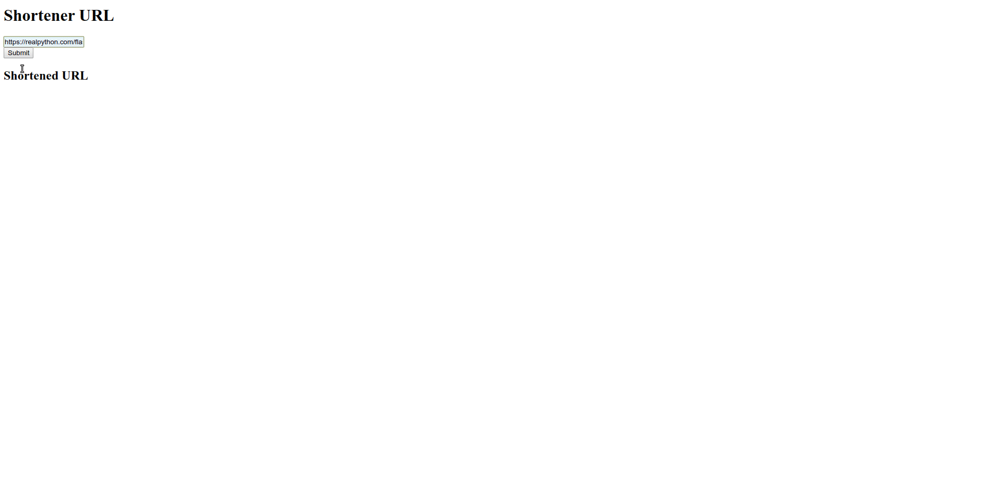

# Shorten URL
Web application for a simple URL shortening service using Flask & redis 

## Table of contents
* [Usage example](#usage example)
* [Technologies](#technologies)

## Usage example

## Technologies
* Python - version 3.7.3
* Flask - version 1.1.1

