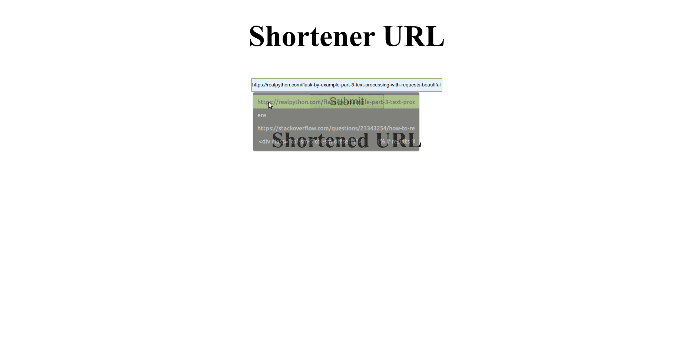

# Shorten URL
A Flask web application to make work with long links easier by reducing of length using short redirection URLs. 
Used Redis as a cache.

## Table of contents
* [Usage example](#usage_example)
* [Technologies](#technologies)

## Usage example

## Technologies
* Python - version 3.7.3
* Flask - version 1.1.1

